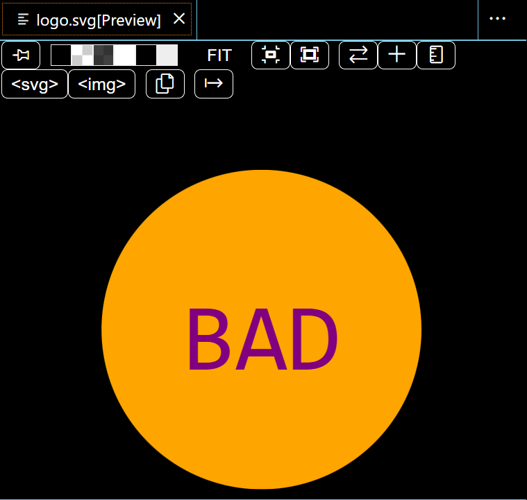
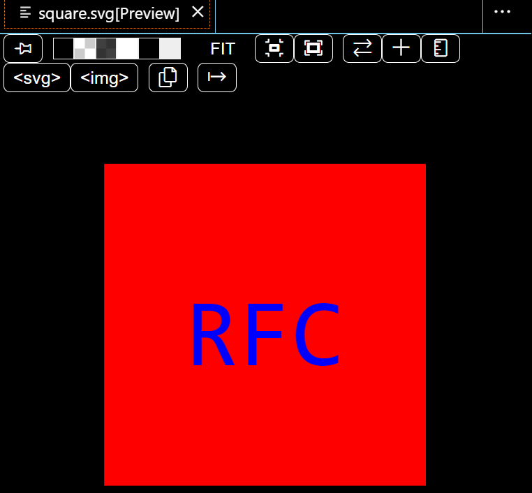
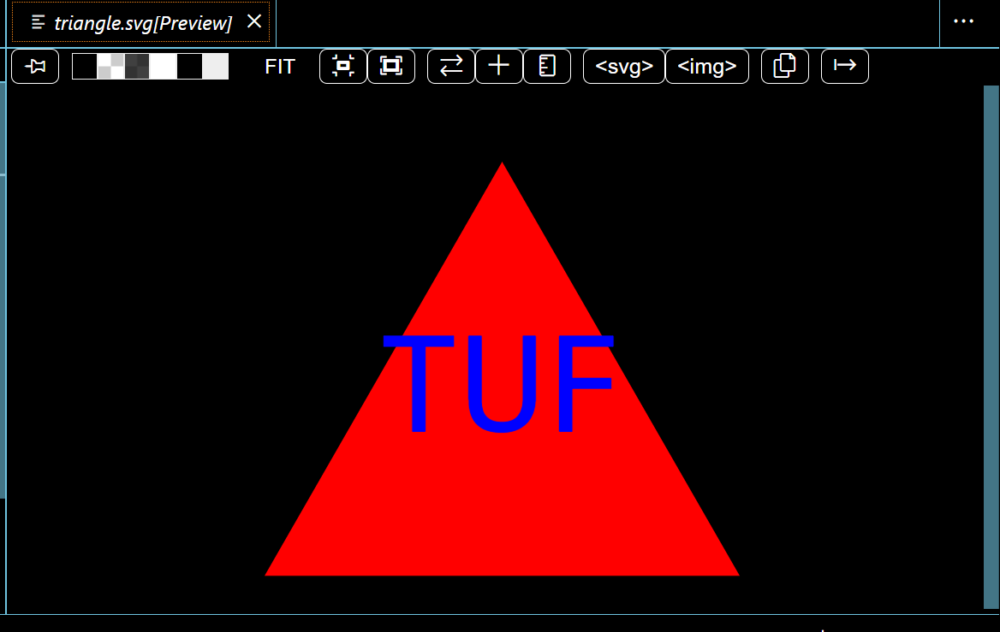

# SVG-Logo-Maker-Graham

## User Story
```md
AS a freelance web developer
I WANT to generate a simple logo for my projects
SO THAT I don't have to pay a graphic designer
```
## Acceptance Criteria

GIVEN a command-line application that accepts user input
WHEN I am prompted for text
THEN I can enter up to three characters
WHEN I am prompted for the text color
THEN I can enter a color keyword (OR a hexadecimal number)
WHEN I am prompted for a shape
THEN I am presented with a list of shapes to choose from: circle, triangle, and square
WHEN I am prompted for the shape's color
THEN I can enter a color keyword (OR a hexadecimal number)
WHEN I have entered input for all the prompts
THEN an SVG file is created named `logo.svg`
AND the output text "Generated logo.svg" is printed in the command line
WHEN I open the `logo.svg` file in a browser
THEN I am shown a 300x200 pixel image that matches the criteria I entered

## Usage Instructions
On CLI opened cloned repo in VS code
go to terminal on index.js
enter 'node index.js' in your CLI
after answering a set of questions via npm inquirer you will complete questions and proceed
you will then be provided with a SVG file within logo.svg
this will contain the logo in the design of your completed answers

## Screenshots:




video walkthrough: <iframe src="https://drive.google.com/file/d/1cEzzS8F6g4j3vcNN-dBRRoAUZO4KII_O/preview" width="640" height="480"></iframe>


## What I Learnt
I learnt how to use jest
I learnt how to generate logos whilst using npm inquirer

## Author
Github: https://github.com/Grahamy27/SVG-Logo-Maker-Graham

## Collaborator

Grahamy27
github: Simonmoore23

